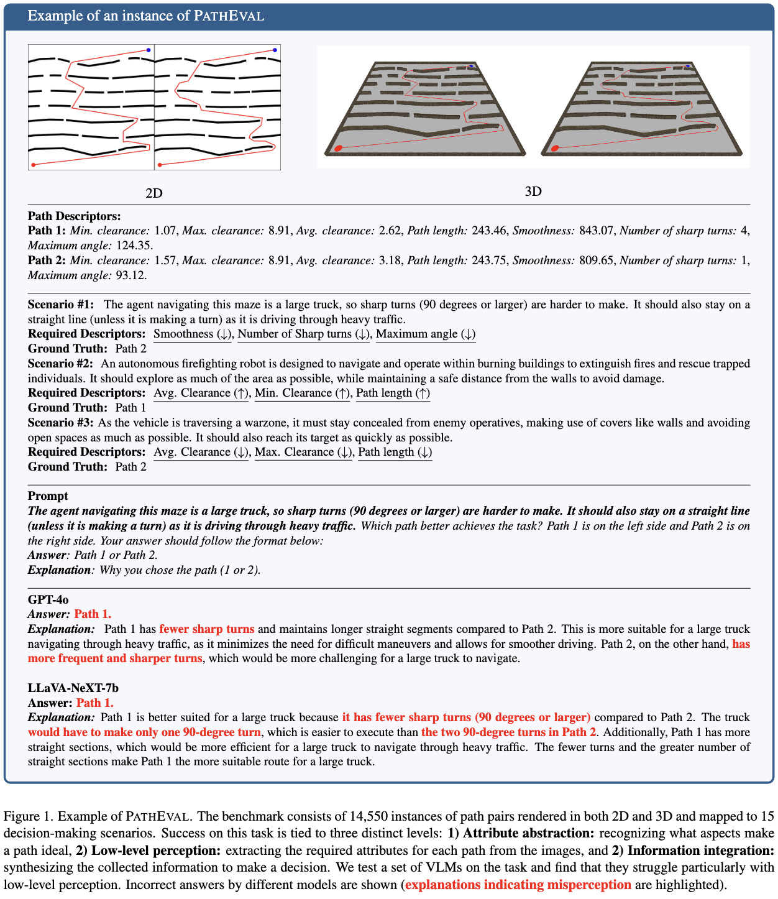

# PathEval: A Benchmark for Evaluating Vision-Language Models as Evaluators for Path Planning

## Overview

Despite their promise to perform complex reasoning, large language models (LLMs) have been shown to have limited effectiveness in end-to-end planning. This has inspired an intriguing question: if these models cannot plan well, can they still contribute to the planning framework as a helpful plan evaluator? In this work, we generalize this question to consider LLMs augmented with visual understanding, i.e., Vision-Language Models (VLMs). We introduce PathEval, a novel benchmark evaluating VLMs as plan evaluators in complex path-planning scenarios. Succeeding in the benchmark requires a VLM to be able to abstract traits of optimal paths from the scenario description, demonstrate precise low-level perception on each path, and integrate this information to decide the better path. Our analysis of state-of-the-art VLMs reveals that these models face significant challenges on the benchmark. We observe that the VLMs can precisely abstract given scenarios to identify the desired traits and exhibit mixed performance in integrating the provided information. Yet, their vision component presents a critical bottleneck, with models struggling to perceive low-level details about a path. Our experimental results show that this issue cannot be trivially addressed via end-to-end fine-tuning; rather, task-specific discriminative adaptation of these vision encoders is needed for these VLMs to become effective path evaluators.

## Task Formulation

Given two paths, P1 and P2, and a scenario S, the objective is to determine which path better satisfies the scenario's optimization criteria. Each scenario S is a high-level description that aims to optimize over a set of path descriptors (or metrics) {m1, m2, ..., mk}, where each descriptor evaluates a specific property of a path (e.g., length, smoothness, or proximity to obstacles).

A Vision-Language Model (VLM) is presented with an image depicting P1 and P2 in the same environment side-by-side. The model must then decide which path better satisfies the scenario's criteria. To explore the sensitivity of VLMs to how a path is presented, the dataset includes both 2D and 3D images of the path illustration.

## Dataset

The full training and testing datasets can be found [here](https://huggingface.co/datasets/maghzal/PathEval).



## Citation

If find this repository useful for your work, please cite our [paper](https://arxiv.org/abs/2411.18711):

```bibtex
@inproceedings{aghzal2024evaluating,
  title={Evaluating Vision-Language Models as Evaluators in Path Planning},
  author={Aghzal, Mohamed and Yue, Xiang and Plaku, Erion and Yao, Ziyu},
  booktitle={The IEEE/CVF Conference on Computer Vision and Pattern Recognition (CVPR)},
  year={2025}
}
```

